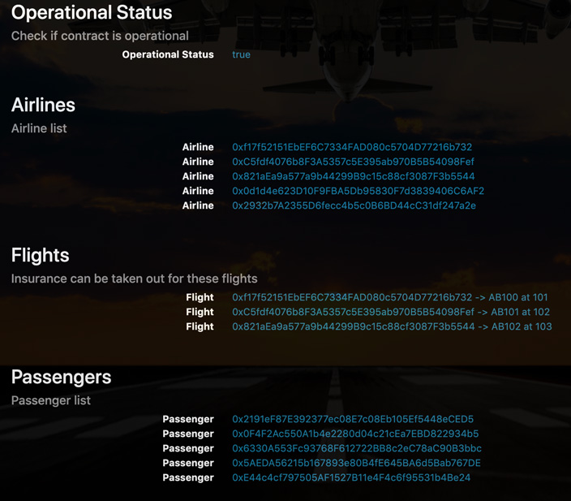

# FlightSuretyApp
## Test instructions
Start new terminals in the project directory and follow these steps:
1. Launch ganache
2. Launch `truffle console`
3. In truffle, enter `migrate --reset`
4. In new terminal enter `npm run server`
5. Wait for oracles to register
6. In new terminal enter `npm run dapp`
7. Navigate to `localhost:8000`
8. Wait for init to finish
    * this will be indicated by the listing of available flights, airlines and passsengers.
    * Should look like this:
    

To request oracle responses, enter a flight number and click submit to Oracles.  
To purchase a policy, enter:
* airline address
* flight
* flight's departure time
* passenger address
* premium in ether
